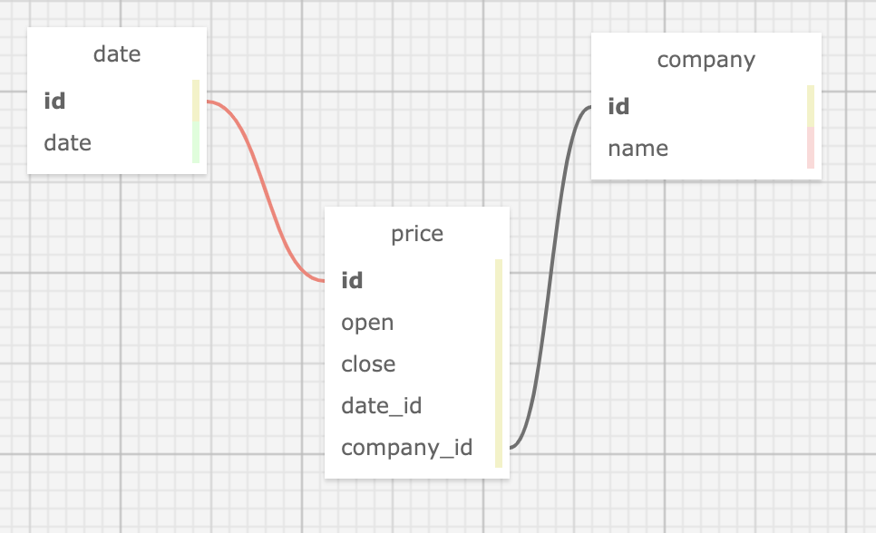

# Phase 1 Review

<u><h3>Today we will be reviewing the following topics:</h3></u>
1. **SQL** 📚
2. **APIs** 📡
3. **Pandas** 🐼

# Tasks

**For this review,** please deliver the following: 

1. A dataframe containing all stock prices for 2017. 
    - Please report if any columns have null values.
    - Drop any null values from this dataframe. 

2. A plot showing how many observations in the data occur on a US public holiday. 
    - Please print the names of the public holidays that are found within the dataset.

3. A statement clarifying whether or not the `BDX` stock rose or fell on Veterans day of 2017. 
   - Please state what the opening and closing price for the stock was on Veterans day, and by how much it changed.


4. A subplot containing two graphs.
    - Plot 1: The top ten stock price *declines* on veterans day of 2017
    - Plot 2: The top ten stock price *increases* on veterans day of 2017
> Please ensure every plot has a contextualizing title

### How will you do this?

You have been given a database called `stocks.db` within the [data/](data/) folder of this repo. 
- This database contains the opening and closing prices for the S&P 500 from 2013-2018.

For data on public holidays, you are to use <u>The Public Holidays API</u> which provides public holiday information for approximately 90 countries. 

The documentation for this API can be found [here](https://date.nager.at/swagger/index.html)

***By combining data from these two sources, you will have the data required to complete the above tasks.***

<center><h3>DATABASE SCHEMA</h3></center>



# Please complete the above tasks below.
>Sections have been provided to offer some guidance and structure as you work through this problem.

# Import Libraries


```python
# Your work goes here
# Feel free to add more cells!
```

# Data Collection

## Query Database


```python
# Your work goes here
# Feel free to add more cells!
```

## Public Holiday API


```python
# Your work goes here
# Feel free to add more cells!
```

### How many observations fall on a public holiday?


```python
# Your work here!
```

### What holidays are found in this dataset?


```python
# Your work here!
```

### Calculate the price change from opening to close

### Plot the top ten prices increases and decreases via subplots
